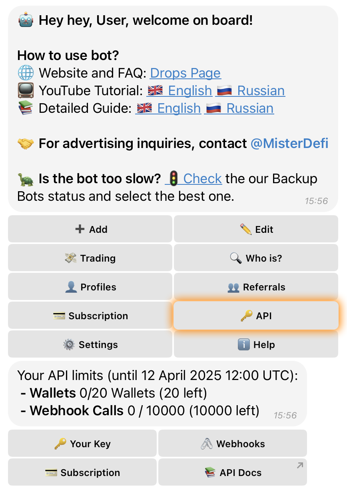

# 🔑 API

## **What is API in Drops Bot?**

The **🔑 API** section in Drops Bot allows users to **integrate external applications and services** with Drops via a secure, customizable API interface.

It is designed for developers, analytics teams, and automation professionals who want real-time access to wallet tracking and on-chain event data.

<div align="left"><figure><figcaption></figcaption></figure></div>

***

### 🔐 **Your Key**

This is your **personal API key**, used to authenticate requests and access Drops API features.

***

### 💳 **Subscription**

This section shows your **current API subscription plan** and usage limits.

**Example:**

```
Your current subscription: Free  
Your API limits (until 12 April 2025 12:00 UTC):  
Wallets: 0 / 20  
Webhook Calls: 0 / 10,000  
```

You can upgrade your plan by clicking **“💳 Choose Subscription Plan”**.

#### Available Plans:

| Plan           | Wallet Limit | Webhook Calls/mo | Price                  |
| -------------- | ------------ | ---------------- | ---------------------- |
| **Free**       | 20           | 10,000           | $0                     |
| **Standard**   | 100          | 100,000          | $9/month or $90/year   |
| **Enterprise** | 500          | 500,000          | $45/month or $450/year |
| **Custom**     | 500+         | Custom           | Custom Pricing         |

When choosing a plan, you'll be prompted to:



**Select payment currency** (USDT, USDC, BUSD, BTC, ETH)



**Choose network** (based on selected currency)



Follow the **payment link** provided

> ❗️ Example: “Send USDT using Tron network”\
> Once payment is completed, you will receive confirmation.



***

#### 🛠️ **Custom Plan**

If you need more than 500 wallets or higher call limits:

* Tap **“🛠️ Build Plan”**
* Enter the desired number of **wallets** (minimum 500)
* Enter or choose the number of **Webhook Calls**
* View the generated plan with options to pay monthly or annually
* You can also **✏️ Edit** before finalizing

***

### 🖇️ **Webhooks**

Manage your **webhooks** here to receive automated notifications to your external systems or apps.

* Add new webhook URLs
* Receive push notifications for tracked events (wallet activity, swaps, etc.)

***

### 📚 **API Docs**

Access the full **API Documentation** — including endpoint details, usage examples, and integration guides.

***

Drops Bot API gives you **scalable, real-time access** to blockchain activity — with flexible plans to grow alongside your needs.
