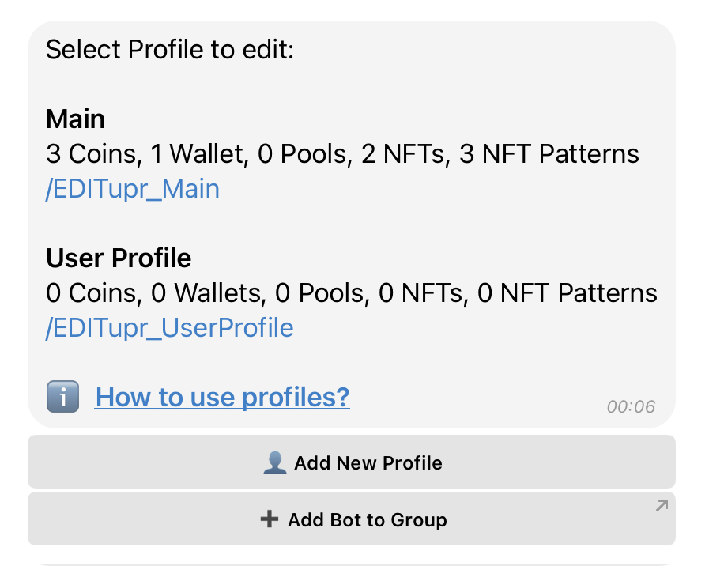

# 👤 Bot for Groups and Channels

The **Profiles** feature in Drops Bot is designed to give you full control over **what notifications you receive and where they are sent** — whether it’s to your **private chat**, a **Telegram group**, or a **channel**.

It’s especially useful for **influencers**, **community admins**, and active users who want their audience to receive real-time alerts about **wallet activity**, **whale movements**, **liquidity changes**, **token listings**, and other key crypto events.


Only **one Drops Bot instance** can be added to a group or channel


***

### 🔍 What Is Drops Bot for Groups & Channels?

If you:

* Manage a crypto group or niche Telegram community
* Want to automatically broadcast important on-chain events
* Or need to separate personal notifications from public ones

You can **add Drops Bot to a group or channel**, apply filters, and let it handle smart, real-time alerts.

💡 All configuration is done from a **single interface**, whether it's for personal use or public broadcasting.

***

### 👤 What Are Profiles?

A **Profile** is a bundle of settings that defines:

* **What to track** — coins, swaps, NFTs, wallets, pools, etc.
* **Where to send alerts** — personal chat, group, or channel

Think of each Profile as a **dedicated alert stream** linked to a specific destination.

***

### 🧩 Types of Profiles

<strong>Main Profile (Default)</strong>

* Created automatically
* Used by default for **private notifications**
*   **Can be linked** to a group or channel

    > If linked, all alerts you receive privately will also be **mirrored** to the group/channel

📌 Ideal if you want to receive the **same alerts in both your private chat and your group**

<strong>Custom Profiles</strong>

* You can create **multiple Profiles** for different purposes
* Each Profile can be linked to:
  * A **separate group**
  * A **channel**
  * Or even a **specific topic** inside a group (Telegram topics are supported)

<figure><figcaption></figcaption></figure>

📌 Example setup:

* **Profile 1** – sends Ethereum whale wallet activity to _Topic A_
* **Profile 2** – sends DEX swap alerts to _Topic B_
* **Profile 3** – monitors NFT mints in a _separate group_

***

### 🔁 Can I Use Drops Bot for Both Private and Group Notifications?

**Yes!** You can:

* Get **personal alerts** via the Main Profile
* And manage **group or channel alerts** at the same time

All from **one centralized interface**, no need to switch bots.

***

### 💬 Short Commands for Groups/Channel

Once Drops Bot is added to a group/channel, admins can use these slash commands:

1. **Search a coin**\
   `/name`, `/ticker`, or `/contract` — Shows real-time data like price, % change, etc.
2. **Help**\
   `/help` — Displays general bot usage guide
3. **Coin Watchlist**\
   `/coins` — Shows coins being tracked and their price movements
4. **NFT Collections**\
   `/nft` — Lists tracked NFT collections and floor price changes
5. **Funding Rates**\
   `/funding` — Shows Binance Futures funding rates
6. **Gas Price**\
   `/gas` — Displays current Ethereum gas prices
7. **GMX Positions**\
   `/gmx_positions` — Shows open GMX derivatives or margin positions

***

### 🧭 Summary

* **Profiles** manage what to track and where to send alerts
* **Main Profile** is your default and supports both private and group usage
* **Custom Profiles** help separate alerts by topic, group or channel
* You can use Drops Bot **simultaneously** for private and public alerts
* All configuration is done from **one control panel**
* Only **one Drops Bot** per group/channel — but with **many Profiles** inside

***

The **Profiles system** makes Drops Bot an ideal solution for anyone who wants to receive the **right signals at the right time**, without clutter or confusion.
