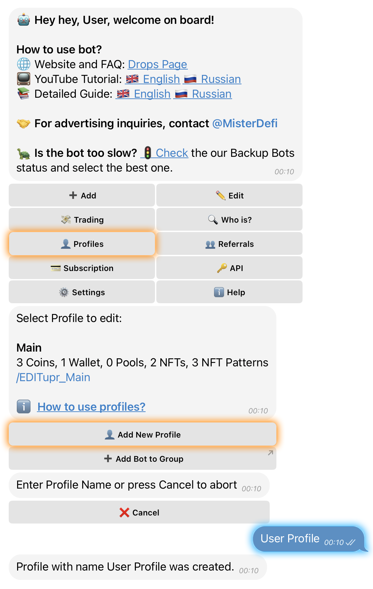

# ➕ Create & Manage Profiles

## ➕ **How to Add a New Profile**



**Open the Main Menu** and tap on **“🔍 Tracking”**.



Select the category **“**&#xD83D;� **My Profiles”** and tap on **“👤 Add New Profile”**.



Enter a **name** for your new Profile



<figure><figcaption></figcaption></figure>


The Profile has been successfully created.


***

## ✏️ How to Edit a Profile



**Open the Main Menu** and tap on **“🔍 Tracking”**.



Select the category **“**&#xD83D;� **My Profiles”.**



**Tap** `/EDIT` **on the Profile you want to manage**



You’ll see an editing menu identical to the main **Configuring** [**Wallet Alerts and Parameters**](../../core-features/wallets/wallet-management/configuring-wallet-alerts-and-parameters.md#wallet-specific-settings-edit-mode) section, but specific to the selected Profile.

All standard configuration buttons are available:

* 👛 **Wallets**
* 💰 **Coins**
* 💎 **NFTs**
* 💹 **Funding Alerts**
* ⛽ **Gas Alerts**, etc.

This menu allows you to configure a completely separate set of settings — coins, wallets, NFT collections, liquidity pools, and alert types — that apply **only** to the group, topic, or channel linked to this specific Profile.


Each Profile operates independently and sends alerts only to its connected destination.


***

To start receiving automated notifications in your Telegram group or channel, you need to **add Drops Bot** and **grant admin rights**. Here's how to do it step by step:

## 👥 **How to Add the Bot to a Group**



**Open the Main Menu** and tap on **“🔍 Tracking”**.



Select the category **“**&#xD83D;� **My Profiles”.**



Tap **“➕ Add Bot to Group”**



Select the group from the list where you want to add Drops Bot



In the pop-up menu, tap **“Add Bot As Admin”**



<figure><figcaption></figcaption></figure>


The bot has now been **successfully added to your group** and is **ready to send alerts**.


***

## 📢 **How to Add the Bot to a Channel**



Open your **channel settings**



Tap **“Subscribers”**



Select Drops Bot from the list



In the next menu, tap **“Make Admin”**, then **“Done”**



<figure><figcaption></figcaption></figure>


**Drops Bot** is now **added to your channel as an admin** and can **post alerts**.



Once the bot is added, you’re ready to connect Profiles to your group, topic, or channel — just **follow the next steps below**, or **click here** to proceed.


***

## ⚙️ Managing Connected Groups/Channels for a Profile

Once a Profile is linked to a group or channel, you can easily control its active status (enable/disable) or remove the connection entirely.

### To manage a specific Profile’s connections:

1. **Navigate to the My Profiles section:**
   * Open the **Main Menu**
   * Select **Tracking**
   * Tap on **My Profiles**
2. **Find the desired Profile and tap** `/EDIT` **beneath its name**
3. **Above the configuration settings**, you'll see a list of all currently connected groups and channels
4. **Each connected group or channel** will display its name along with an **On/Off toggle switch**
   * Tapping this button enables or disables alerts for that specific chat

### **To remove a connected group or channel:**

1. Scroll to the bottom of the connected groups list
2. Tap the **"🗑️ Delete Group"** button
3. A list of connected groups will appear — select the one you wish to unlink and remove
