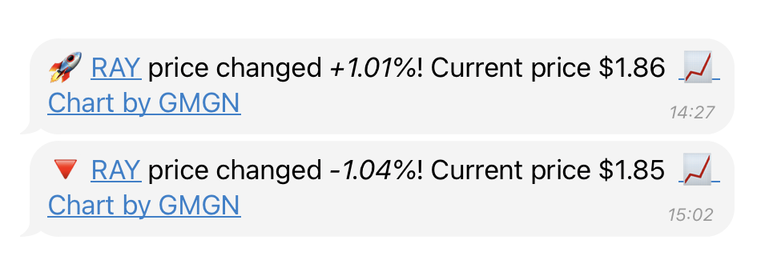
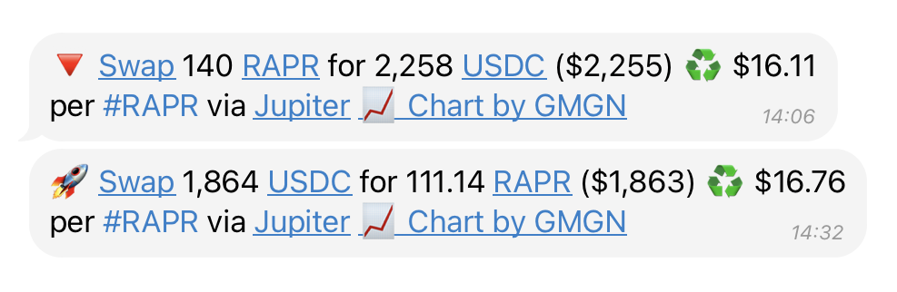
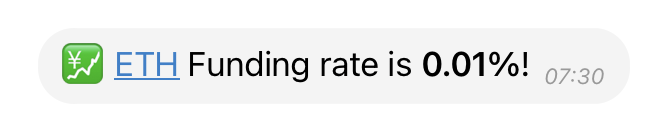

# 🪙 Coins

## ⚡️ Real-Time Coin Monitoring

Drops Bot empowers you with **unparalleled control** over your cryptocurrency watchlist. Receive **instant, real-time alerts** for critical market movements—including token price changes, DEX swap activity, and funding rate data—delivered directly to your Telegram. You can **fully customize** how each coin is tracked, define which specific events trigger notifications, and precisely what information appears in your **personal dashboard**, ensuring you stay informed with exceptional precision.

***

## 🔍 What You Can Track with Drops Bot

#### 📈 Price Alerts

Get notified the moment a coin price moves above or below your defined thresholds.\
Useful for momentum shifts, entry/exit triggers, and volatility detection.

<figure><figcaption></figcaption></figure>

#### 🔁 DEX Swaps Monitoring

Track large onchain swaps by value (e.g. > $100,000) and filter alerts for buys, sells, or both.\
Helps you detect whale trades and market reactions early.

<figure><figcaption></figcaption></figure>

#### 💹 Funding Rate Alerts (Binance Futures)

Stay updated on funding rate changes — a critical metric for futures traders.

<figure><figcaption></figcaption></figure>

***

## ✨ Coin Dashboard Overview

The **Coin Dashboard** shows all tracked tokens with real-time market data and short-term analytics.


#### &#x20;Accessing the Dashboard

* Use the inline button: 🪙 **Coins**
* Or run the command: `/coins`&#x20;


<figure><figcaption>
Coins Dashboard
</figcaption></figure>

***

## 🏷️ Quick Commands

* `/coins` — Opens your personalized Coin Dashboard overview
* `/edit` — Modify settings for any token
* **Send a coin contract address:** If you send the contract address of a _currently tracked coin_ directly in the chat, its edit menu will pop right up!
