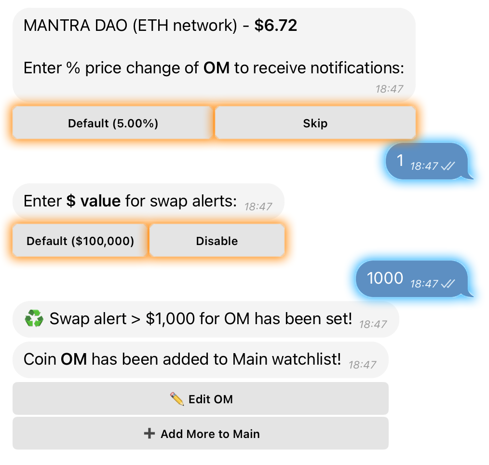
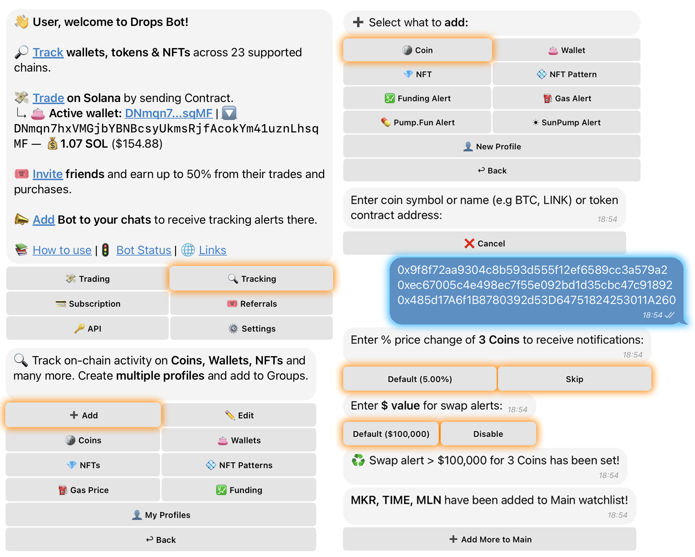

# ➕ Add Coin



**Open the Main Menu** and tap on **“🔍 Tracking”**.



Select the category **“➕ Add”** and tap on **“🪙 Coin”**.

<figure><figcaption></figcaption></figure>




Enter the **contract address, ticker, or coin name**.

* If you enter a **contract address**, the bot will automatically detect the correct network, and you won’t need to choose it manually.
* If you enter a **ticker or coin name**, you’ll need to select the network where you want to monitor it.



Find your coin in the list and choose **which network to monitor** it on.

* If you select a blockchain network instead of a **CEX (Centralized Exchange)**, you will also be able to track DEX swaps for that coin.

<figure><figcaption></figcaption></figure>




Set the **percentage price change** or choose the default **5%**, and specify a **$ value for swap alerts** on DEX.

* Now, you’ll receive notifications whenever the price or swaps involving this coin fluctuate within your chosen range.

<figure><figcaption></figcaption></figure>




#### You can also **add coins in bulk**:

* Simply send multiple contract addresses in the chat, each on a **new line**.
* Or upload a **text file** containing a list of contract addresses.

<figure><figcaption></figcaption></figure>


**Success!** Your coin is now being tracked.&#x20;

