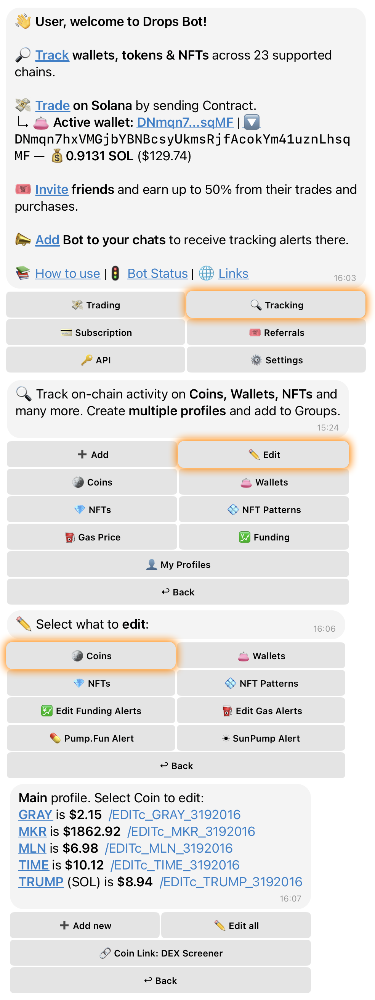

# 🔑 Accessing Coin Settings

## 👀 Viewing All Tracked Coins

To see a list of all the coins you're currently tracking, follow these steps:

1. Open the **Main Menu**.
2. Select the "🔍 **Tracking**" category.
3. Tap on "**✏️ Edit**".
4. Select the "🪙 **Coins**" category.

## 📝 Editing a Specific Coin

If you need to adjust the settings for one particular coin:

1. Open the **Main Menu**.
2. Select the "🔍 **Tracking**" category.
3. Tap on "**✏️ Edit**".
4. Select the "🪙 **Coins**" category.
5. **Choose the coin** you want to edit and tap on its **`/EDIT`** link.

## 📦 Bulk Editing All Tracked Coins

Looking to apply changes to all your tracked coins at once? Here's how:

1. Open the **Main Menu**.
2. Select the "🔍 **Tracking**" category.
3. Tap on "**✏️ Edit**".
4. Select the "🪙 **Coins**" category.
5. Tap the "**✏️ Edit all**" button.
   * _Note: This option is only available if you are tracking two or more coins._

***

<figure><figcaption>
Coins Section
</figcaption></figure>

***

## ⚡️ Quick Access Tips

Want to save some time? Try these shortcuts to jump directly into coin settings:

* **Use the `/edit` command:** Simply type `/edit` in the chat and select the "🪙 **Coins**" section. This is a handy way to bypass the main menu.
* **Send a coin contract address:** If you send the contract address of a _currently tracked coin_ directly in the chat, its edit menu will pop right up!
