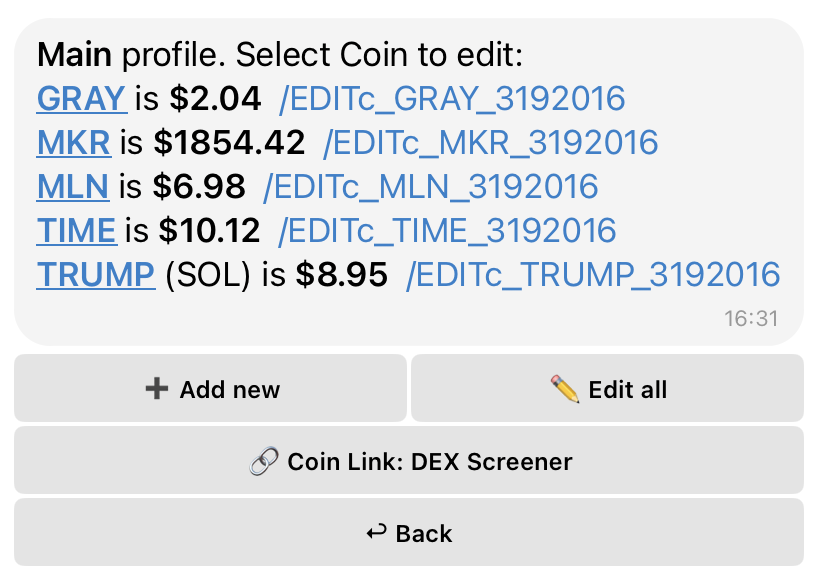
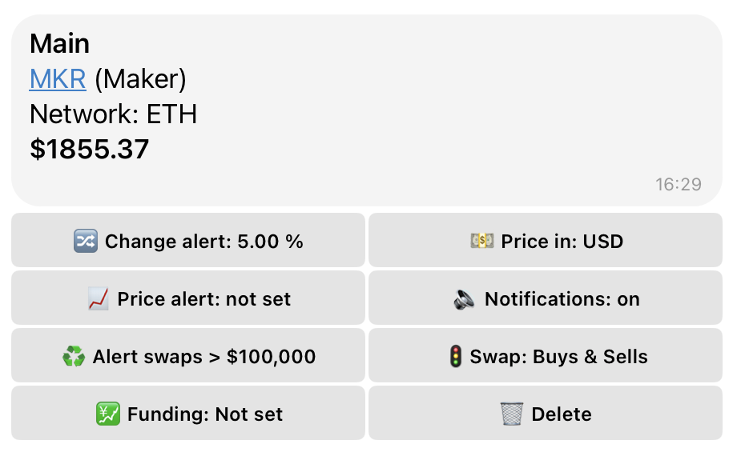

# 🔔 Configuring Coin Alerts and Parameters

## 🌐 Global Coin Management Options

<figure><figcaption>
Global Settings
</figcaption></figure>

When viewing your list of tracked coins, you'll find these general management buttons:

* **➕ Add new** – Add a new coin to your watchlist.
* **🔗 Coin Link** – Choose your preferred data provider for links in token notifications. When an alert is triggered, the link in the notification will direct you to the selected data source.
  * **Available Providers:**
    * **DexCheck** – Analytics and data for decentralized tokens.
    * **Gecko** – Provides price, market cap, and other token data.
    * **Blockscan** – Tracks addresses and transactions linked to the coin.
    * **GMGN** – Offers in-depth market insights and token movement analysis.
* **✏️ Edit all** – Bulk edit settings for all your added coins.
  * _Note: This option is only available when two or more coins are being tracked._

## 📝 Individual Coin Settings (/EDIT Mode)

<figure><figcaption>
Coin Settings
</figcaption></figure>

Once you're in the **/EDIT** mode for a specific coin, you can configure the following detailed settings:

* **🔀 Change Alert** – Adjust the percentage price change that triggers a notification.
* **📈 Price Alert** – Set a notification when the coin reaches a specific price target (default: not set).
* **♻️ Alert Swaps** – Enable notifications for swaps exceeding a specified amount (available only for DEX networks).
* **💹 Funding** – Configure alerts for futures funding rate changes (alerts when the rate is above or below a set value, default: not set).
  * _Enter values from -1 to 1 (e.g., `< -0.3` or set a range like `< -0.3 > 0.5`)._
* **💵 Price In** – Select the currency for price display (USD, BTC, ETH, BNB). (Default: USD)
* **🔉 Notifications** – Enable or disable all alerts for this coin (ON/OFF).
* **🚦 Swap Direction** – Set alerts for specific swap types:
  * **Buys:** Receive alerts only for buy transactions of this coin.
  * **Sells:** Receive alerts only for sell transactions of this coin.
  * **Both:** Receive alerts for both buy and sell transactions.
* **🗑️ Delete** – Remove this specific coin from your watchlist.
