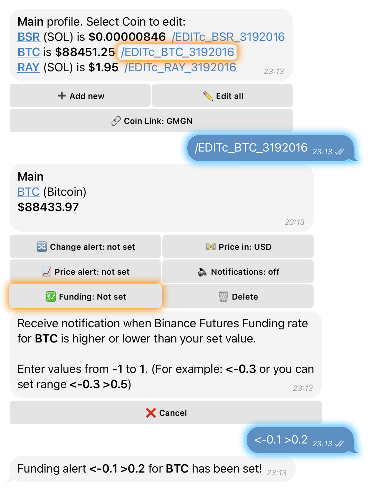
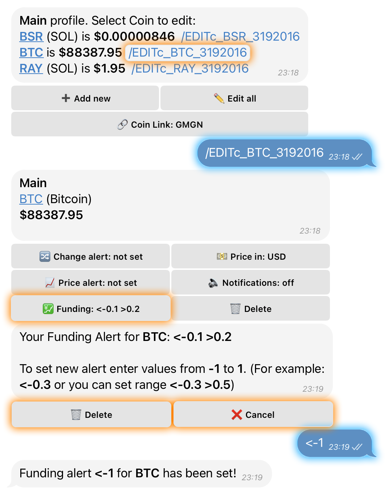

# 💹 Funding Alerts

### **1️Global Funding Alert**

#### 🔔 What It Does

A **Global Funding Alert** notifies you when the funding rate for **any coin (except those you already track)** reaches your specified threshold.

#### 🛠️ How to Set It Up



**Open the Main Menu** and tap on **“🔍 Tracking”**.



Select the category **“➕ Add”** and tap on **“💹 Funding Alert”**.



Enter your **desired funding rate value**



<figure><figcaption></figcaption></figure>


Alert is now active. You'll be notified when **any untracked coin** reaches this rate.


### **️Edit or Delete Global Funding Alert**



**Open the Main Menu** and tap on **“🔍 Tracking”**.



Select the category **“✏️ Edit”** and tap on **“💹 Edit Funding Alerts”**.



Choose one of the following options:

* Enter a **new value** to update the alert
* Tap **🗑️ Delete** to remove the alert
* Tap **❌ Cancel** to exit without changes



<figure><figcaption></figcaption></figure>

***

### **2️Funding Alert for a Specific Coin**

#### 🔔 What It Does

Set an alert for the **funding rate of a specific coin** you’re tracking. Perfect for coin-focused strategies.

#### 🛠️ How to Set It Up



Open the settings of the **coin already added to your watchlist**



Tap **“💹 Funding”**



Enter your **target funding rate**



<figure><figcaption></figcaption></figure>


You’ll be **notified** when the **funding rate** for that coin **reaches the set value**.


### **Edit Funding Alert for a Specific Coin**



Go to the **coin’s settings**



Tap **“💹 Funding”**



Enter a **new funding threshold** to update the alert



<figure><figcaption></figcaption></figure>

***

### **3️Funding Dashboard (Current Rates Overview)**

#### 🛠️ How to Access

* Send the command **/funding** in chat

#### 🧾 What You’ll See

* A list of **current funding rates** for all **USDT pairs on Binance Futures**
* Each entry includes:
  * The **latest funding rate**
  * Its **8-hour change**, displayed in percentage


This dashboard updates in real-time, giving you a complete overview of market funding dynamics.

