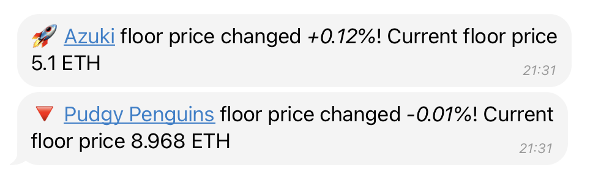
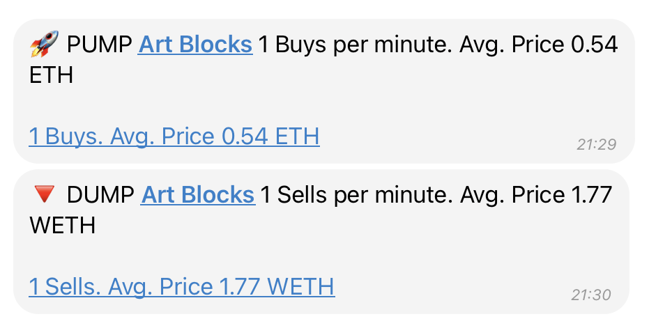

# 💎 NFT

Drops Bot provides flexible and powerful tools to track **any NFT collection on the Ethereum network** and monitor the activity of **smart money wallets**.

### 🔍 Key Features

#### **📉 Floor Price Tracking**

<figure><figcaption></figcaption></figure>

* Monitor the **floor price** of NFT collections in **ETH / USD / BNB / BTC**.
* Set **custom percentage changes** or **target prices** to receive instant alerts.
* No need to constantly check charts — get notified the moment your target price is hit.

#### **📈 Pump & Dump Detection**

<figure><figcaption></figcaption></figure>

* Identify **sudden surges or drops** in activity.
* Get alerts when major **buyers or sellers** enter the market — often ahead of significant price changes.
* A valuable edge for **timely buying or selling decisions**.

***

#### **Quick Commands:**

* **/nft** – View your tracked NFT collections
* **/add** – Add a new NFT collection to your watchlist
