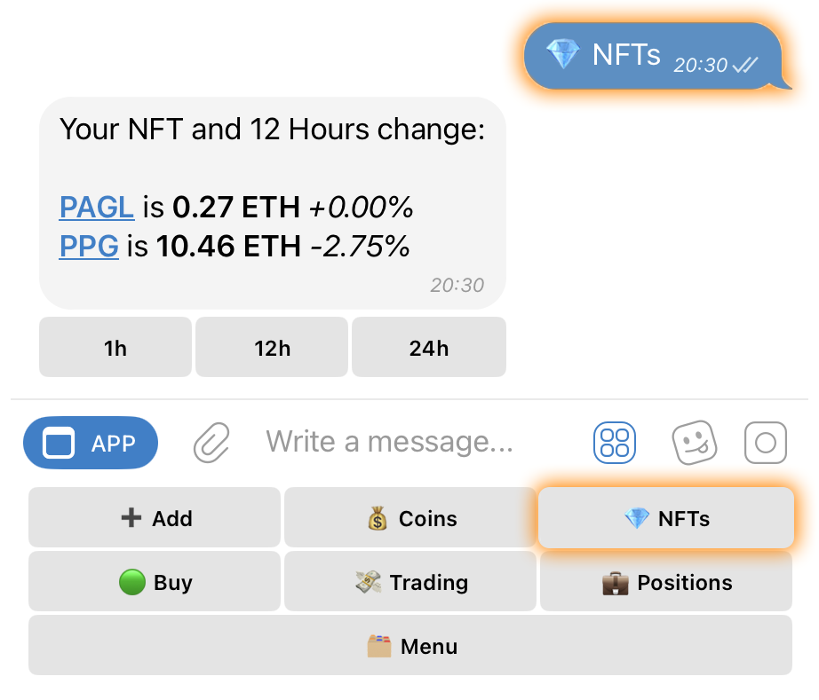

# ✨ NFT Dashboard

### Accessing the NFT Dashboard

* Select **“💎 NFTs”** from the **inline keyboard**, or
* Send the command **/nft** in chat.

<figure><figcaption></figcaption></figure>

***

### Collection Names & Prices

* The dashboard displays **all NFT collections you're tracking**.
* For each collection, the **current floor price** is shown.

### Price Change

* Next to each collection’s price, you'll see a **percentage change** based on the selected time frame.

### Clickable Collection Links

* Tapping on the **collection name** opens a link to the selected **data provider’s** site (set via **🔗 NFT Link** in settings).

### Time Interval Buttons

Located below the collection list, these buttons let you adjust the analysis window for price change data:

* **1h** – View changes in the last **1 hour**
* **12h** – View changes over the last **12 hours**
* **24h** – View changes over the last **24 hours**

Tapping a button updates the displayed **price** and **percentage change** based on your selected timeframe.
