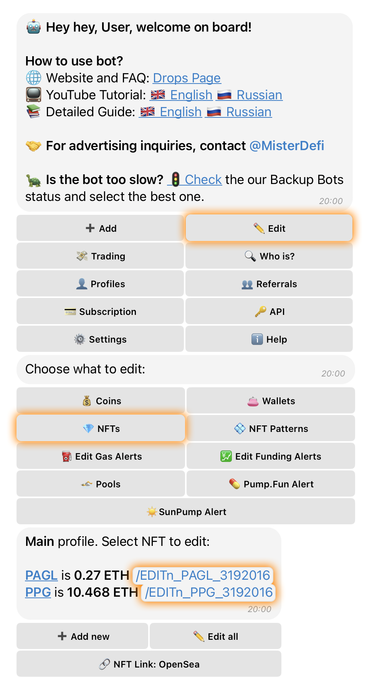
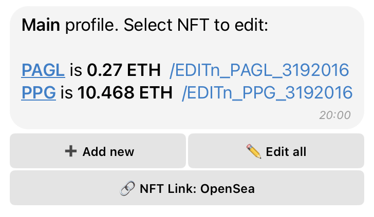
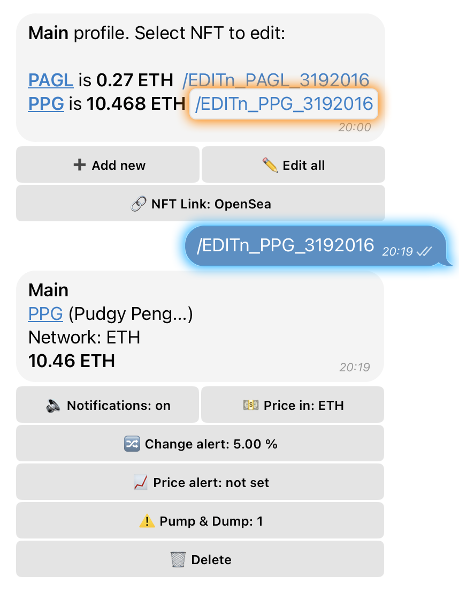

# ⚙️ NFT Management

## 👀 Viewing All Tracked NFTs

1. **Open the Main Menu** and tap on **“🔍 Tracking”**.
2. Select the category **“✏️ Edit”** and tap on **“💎 NFTs”**.

## 📝 Editing a Specific NFT

1. **Open the Main Menu** and tap on **“🔍 Tracking”**.
2. Select the category **“✏️ Edit”** and tap on **“💎 NFTs”**.
3. Choose the NFT collection you want to edit and click the **“/EDIT”** link.

<figure><figcaption></figcaption></figure>

## 📦 NFT Editing Menu Options

<figure><figcaption></figcaption></figure>

* **➕ Add new** – Add a new NFT collection. _(See details_ [_here_](add-nft.md)_)_
*   **🔗 NFT Link** – Select a data provider for the link that appears in NFT alerts. When an alert is triggered, it will include a link to the chosen source.

    **Available Providers:**

    * **OpenSea** – Floor price, volume, and activity data.
    * **Blur** – Advanced trading tools and real-time data.
    * **Gecko** – Analytical insights on NFT prices, market cap, and more.
* **✏️ Edit all** – Bulk edit settings for all added NFT collections. _(Only available if two or more collections are being tracked.)_

***

## ⚙️ Settings in /EDIT Mode (Per Collection)

<figure><figcaption></figcaption></figure>

* **🔈 Notifications** – Enable or disable alerts for the selected collection.
* **💵 Price in** – Choose display currency (**ETH** by default; also supports **USD**, **BTC**, **BNB**).
* **🔀 Change alert** – Set a % change that triggers floor price alerts.
* **📈 Price alert** – Trigger an alert when the floor price hits a specific value (not set by default).
* **⚠️ Pump & Dump** – Set a threshold for NFT buys/sells per minute to detect spikes in activity.
* **🗑 Delete** – Remove the collection from your tracked list.

***

## **✏️ Parameters in "✏️ Edit All" Mode**

The settings available in **Edit All** mode for NFT collections are **identical** to those in individual NFT collection editing, with **one exception**:

> The **Price Alert** parameter is **not available** in bulk editing.
