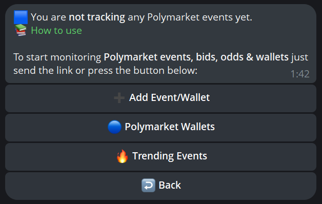

# 🔷 Polymarket

### 👀 Overview

Drops Bot delivers instant real-time alerts for Polymarket activity on Polygon straight to your Telegram. It reads public on-chain data without needing a Polymarket account, signing transactions, or touching your funds.

Track any Polymarket event or whale wallet in real time and get instant alerts on price movements, odds changes, volume, and smart-money bets.


The Bot does **not** trade for you. It only monitors Polymarket activity and reports it via Telegram — what you do with that information is up to you.


| What you track        | What you get                                                   |
| --------------------- | -------------------------------------------------------------- |
| **Polymarket events** | One specific market, regardless of who trades on it            |
| **Whale wallets**     | One wallet's Polymarket trades, across every market it touches |

### ⚡ Quickstart



#### Open **Main Menu → 🟦 Polymarket** or just type `/polymarket`

If you are not tracking anything yet, you will see:

<figure><figcaption></figcaption></figure>




#### Use **➕ Add Event/Wallet** button to start tracking:

* a specific **Polymarket event**
* or a specific **wallet**



#### Discover 🔥Trending Events

Browse and add this month’s **Polymarket Trending Events by 24h vol**.

<figure><figcaption></figcaption></figure>




#### Review your dashboard

Open `/polymarket` again and review both tracking areas:

* **🟦 Your current events list**

<figure><figcaption></figcaption></figure>

* **🔵 Polymarket Wallets**

<figure><figcaption></figcaption></figure>




### ⚙️ Alerts & Management

Tap the **“✏️”** button next to any event or wallet that you track.

The settings menu opens here:

<figure><figcaption></figcaption></figure>

| Setting           | What it does                                                                                                      |
| ----------------- | ----------------------------------------------------------------------------------------------------------------- |
| **Notifications** | Turn alerts **On** or **Off** for the specific event                                                              |
| **Price Change**  | Set a **¢ price change**. Example: **10¢**. You are notified each time the price changes by that amount or more   |
| **Price Target**  | Set a **¢ price target**. Example: **100¢**. You are notified when the price reaches this target                  |
| **Swaps Alert**   | Set a **swap alert threshold**. Example: **$10K**. You are notified when someone trades for more than this amount |
| **Volume Target** | Set a **$ volume target**. Example: **$100K**. You are notified when **total odd volume** reaches it              |
| **Delete**        | Remove the event from your tracking list                                                                          |


Settings apply to the specific tracked event or odd you edit.


<strong>🖼️ See setting examples</strong>

**Price Change**

<figure><figcaption></figcaption></figure>

**Price Target**

<figure><figcaption></figcaption></figure>

**Swaps Alert**

<figure><figcaption></figcaption></figure>

**Volume Target**

<figure><figcaption></figcaption></figure>

### 📘 Glossary

| Term           | Meaning                                                                                                             |
| -------------- | ------------------------------------------------------------------------------------------------------------------- |
| **Wallet**     | One public wallet you track across every Polymarket market it touches                                               |
| **Event**      | One specific Polymarket market you track                                                                            |
| **Odd**        | A tracked outcome inside a market                                                                                   |
| **Outcome**    | A specific possibility within an event                                                                              |
| **Share**      | A position unit on Polymarket. A `YES` share pays `$1` if the outcome resolves true, `$0` otherwise                 |
| **Price (¢)**  | Per-share price in cents. Equivalent to the market's implied probability — e.g., `23.4¢` ≈ 23.4 % chance            |
| **Resolution** | The moment an event's outcome is finalized and shares pay out. Tracking stops automatically at resolution           |
| **Share-swap** | A trade where shares change hands directly between users on the order book — the data source for **♻️ Swaps Alert** |

### 📦 Plan Limits

Your Polymarket tracking capacity depends on your active subscription.

| Plan              | Wallets/Events | Messages per hour | Swap alert |
| ----------------- | -------------- | ----------------- | ---------- |
| **Free/Basic**    | 20             | 100               | ≥$1000     |
| **Advanced**      | 100            | 500               | >$0        |
| **Pro**           | 500            | 1000              | >$0        |
| **Wallet Sniper** | 2000           | 2000              | >$0        |
| **Custom**        | Custom         | Custom            | >$0        |

#### What happens when you reach a limit

When you hit a plan limit, the bot notifies you and suggests one of two actions:

1. **Edit** your current list.
2. **Upgrade** your subscription plan.

If you hit your **hourly notification cap**, the bot also sends a warning.


Plan limits apply to tracked items and message volume. They do not change how Polymarket monitoring works.


#### Upgrade path

Drops Bot offers several subscription plans to expand your tracking limits and unlock advanced features. You can subscribe via the **website** or using **Telegram Stars** inside the bot.

For detailed plan comparison (price, all quotas, payment methods), see the [main Subscription docs.](https://etherdrops.gitbook.io/etherdrops-bot/core-features/subscriptions)

### 🔧 Troubleshooting & FAQ

#### General

<strong>What networks does Polymarket tracking support?</strong>

**Polygon only.** Polymarket itself runs on Polygon PoS, so all event tracking and wallet Polymarket activity is scoped to Polygon. Wallet activity on Ethereum, Base, Solana, or any other chain — even on the same wallet address — does not produce Polymarket-flavoured alerts.

<strong>Do I need a Polymarket account or to connect a wallet?</strong>

No. Tracking is read-only. You provide the bot with public event URLs and/or watched wallet addresses; nothing in your own funds is ever touched.

<strong>What should I do if a specific event URL does not work?</strong>

Open the exact market page on `polymarket.com` and copy that URL again. Category pages are not accepted.

<strong>Is there a shortcut command for Polymarket?</strong>

Yes — **`/polymarket`** opens your watchlist directly.

#### Tracking & Limits

<strong>What's the difference between event tracking and wallet activity tracking?</strong>

**Event tracking** watches one specific Polymarket market regardless of which wallet trades on it. \
**Wallet activity tracking** watches one wallet across all the Polymarket markets it touches.

<strong>Can I track multiple outcomes of a multi-outcome market?</strong>

Yes. A multi-outcome market is tracked as a single event, and alerts fire on movement in any of its outcomes.

<strong>How many events can I edit at once?</strong>

Bulk edit applies a change to your entire Polymarket Events list in a single operation. There is no separate per-batch cap beyond your plan limit.

<strong>What happens when a market resolves?</strong>

Tracking stops automatically. The event remains in your list as a historical record but no longer fires alerts. Periodically clean resolved events out via bulk-remove to keep slots free.

<strong>Will I lose my settings if I remove and re-add an event?</strong>

Yes. Removing an event clears its per-event settings. Re-adding it starts with fresh defaults.

#### Notifications

<strong>Can I route Polymarket alerts to a Telegram group instead of my private chat?</strong>

Yes. Connect a profile to a group via [Bot for Groups and Channels](https://etherdrops.gitbook.io/etherdrops-bot/advanced-tools/bot-for-groups-and-channels) and configure that profile to handle Polymarket events.

<strong>Can I disable Polymarket alerts without removing events?</strong>

Yes. Set the global Alert frequency to **Off**, or mute individual events. Tracking remains intact; only the notifications stop.

#### Account & Data

<strong>What happens to my Polymarket Events when I delete my account?</strong>

All tracked Polymarket Events are removed permanently as part of account deletion.

<strong>Can I export my event list?</strong>

Export follows the same pattern as wallet and coin export, if it is available in your bot menu. If the option is not present, it is not available for Polymarket Events yet.

<strong>Does the bot store my Polymarket trading history?</strong>

The bot only stores **what you ask it to track** (event references, wallet addresses) and the alerts it has sent. It does not aggregate or republish your trading positions.

