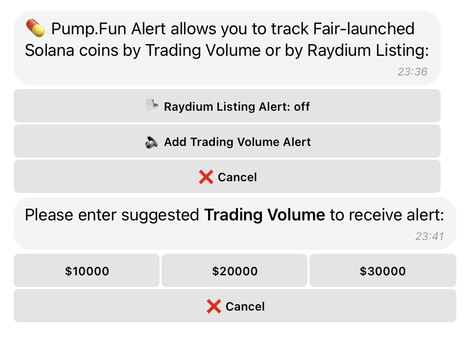

# 💊 Pump.Fun

**💊 Pump.Fun Alert** is a feature designed to track **fair-launched** tokens on the **Solana** network — tokens that are deployed without prior announcements. It helps you stay informed about new launches, increasing trading activity, and listings on platforms like **Raydium**.

***

### 🛠️ How to Enable Pump.Fun Alert



**Open the Main Menu** and tap on **“🔍 Tracking”**.



Select the category **“➕ Add”** or **“✏️ Edit”** and tap on **“💊 Pump.Fun Alert”**.



**Alternatively**, you can quickly open the Pump.Fun settings menu by sending the command:

`/pumpfun`



<figure><figcaption></figcaption></figure>

#### ⚙️ Available Options

<figure><figcaption></figcaption></figure>

**📄 Raydium Listing Alert**

* Toggle this option **ON/OFF** to receive alerts when a token gets listed on **Raydium**
* Helps you react quickly to new market listings

🔈 **Trading Volume Alert**

* Set up alerts based on **trading volume thresholds**
  * Choose from preset values:
    * **$10,000**
    * **$20,000**
    * **$30,000**
    * Or **enter a custom value** manually (_Min. amount is $1000_.)

***

### **➕ Adding and ✏️ Editing Pump.Fun Tokens**

The process of adding a token launched via **Pump.Fun** is **exactly the same** as adding any regular coin in Drops Bot.

Similarly, **editing a Pump.Fun token** is also **identical** to editing a regular coin.


For more details, see the [**How to Add a Coin**](coins/add-coin.md) section.

See the [How to Edit a Coin](coins/coin-management/configuring-coin-alerts-and-parameters.md#individual-coin-settings-edit-mode) section for full instructions.


Once added, the Pump.Fun token will be fully trackable with all standard features — including price alerts, swap volume tracking, and real-time notifications.

***

### 🚀 Why Use It?

* Be the first to spot **new token launches** on Solana
* Detect early **volume spikes and activity trends**
* Act before the hype — based on real-time data, not noise

**Pump.Fun Alert** is your edge for tracking and reacting to new token momentum before it becomes mainstream.
