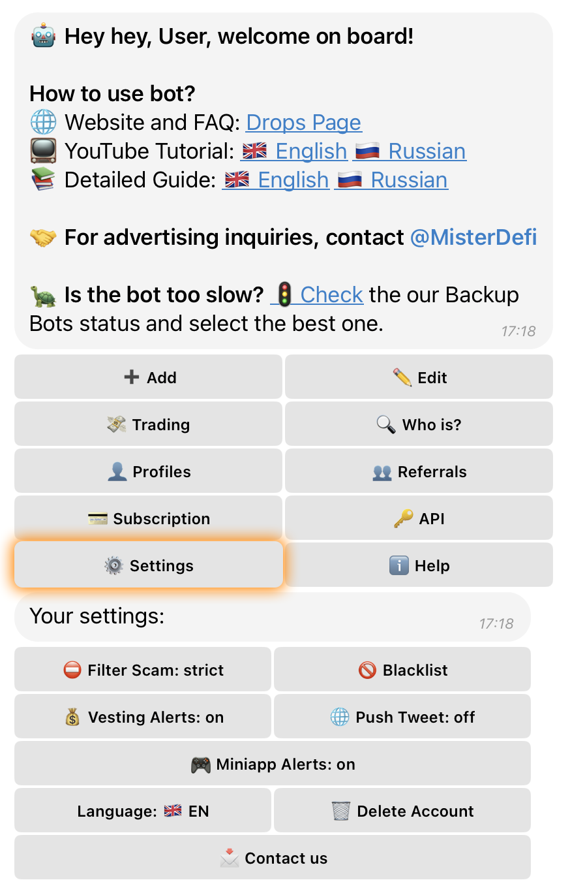
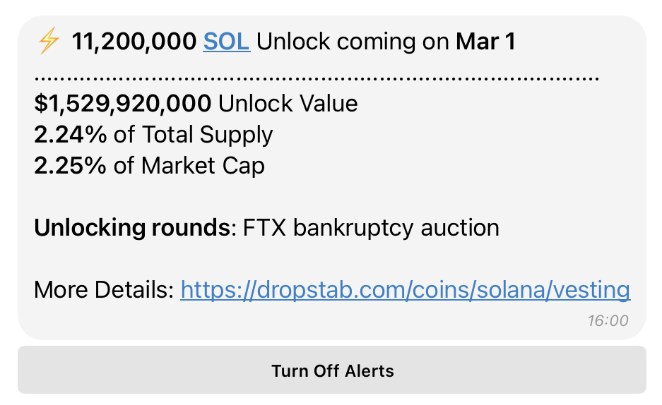
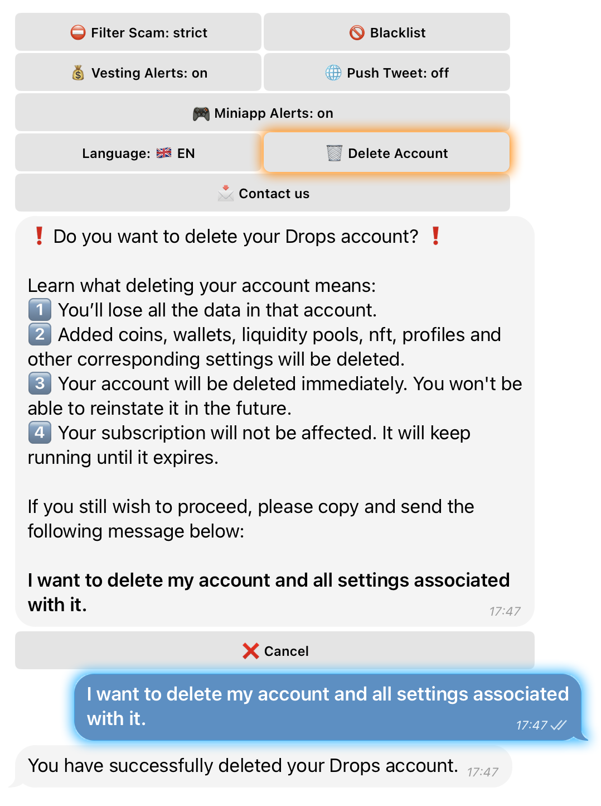

# ⚙️ Settings

The **⚙️ Settings** section in Drops Bot allows you to customize how the bot works, filter unwanted activity, manage alerts, set language preferences, and control your account-level features — all from one place.

<div align="left"><figure><figcaption></figcaption></figure></div>

***

### 🔧 **Available Settings & Features**

#### ⛔ **Filter Scam**

Controls the level of scam filtering in your notifications.

* **Off** — No filtering
* **Lite** — Basic scam filtering (default)
* **Strict** — Aggressive filtering to block risky or suspicious activity

***

#### 💰 **Vesting Alerts**

<div align="left"><figure><figcaption></figcaption></figure></div>

Enables alerts about **upcoming token unlocks** (vesting events).\
You’ll be notified when tokens under lock become available for transfers or trading.

***

#### 🌍 **Language**

Set the interface language. Supported options include:

* 🇧🇩 Bengali
* 🇺🇸 English
* 🇪🇸 Spanish
* 🇮🇳 Hindi
* 🇮🇩 Indonesian
* 🇵🇹 Portuguese
* 🇷🇺 Russian
* 🇹🇭 Thai
* 🇺🇦 Ukrainian
* 🇻🇳 Vietnamese

***

#### 🚫 **Blacklist**

Block notifications from specific **wallets** or **token contracts**.\
Useful for avoiding alerts related to known scam tokens, airdrops, or addresses you don’t want to track.

***

#### 🗑️ **Delete Account**

Permanently deletes your Drops Bot account, including all:

* Tracked wallets & Polymarket Events
* Coins
* NFTs
* Profiles and settings

> ⚠️ This action is irreversible.\
> Your **active subscription will remain valid** until it expires, even after deletion.

***

### 📘 **How to Create a Blacklist**



Open **Main Menu → ⚙️ Settings**



Tap **“🚫 Blacklist”**



Tap **“Add Wallet or Contract”**



Enter one or more wallet/contract addresses (one per line), or upload a `.txt` file

* ⚠️ File must be **under 100 bytes**
*   Example format:

    ```
    0x25AaF13451E66f4F322a6105F7b295d1A7e9DA96  
    0x5efdB6D8c798c2c2Bea5b1961982a5944F92a5C1
    ```



Select the desired networks

All networks are selected by default; you can deselect any



Tap **“☑️ Done”**



<figure><figcaption></figcaption></figure>


The address has been added to your blacklist.


***

### 📘 **How to Delete Your Account**

> ⚠️ This action is **irreversible** — all settings, profiles, wallets, coins, NFTs, etc. will be permanently deleted.\
> Your **subscription will remain active** until its end date.



Open **Main Menu → ⚙️ Settings**



Select **“🗑️ Delete Account”**



Enter and send the exact text:

```
I want to delete my account and all settings associated with it.
```



Confirm the action



<div align="left"><figure><figcaption></figcaption></figure></div>


Your account has been deleted.


***

#### 📩 **Contact Us**

Reach out to support or join community chats:

* 🇬🇧 English support: [@dropstab\_EN](https://t.me/dropstab_EN)
* 🇷🇺 Russian support: [@dropstab\_com](https://t.me/dropstab_com)\
  Or tap **“💬 Write us here”** to open a direct support chat.
