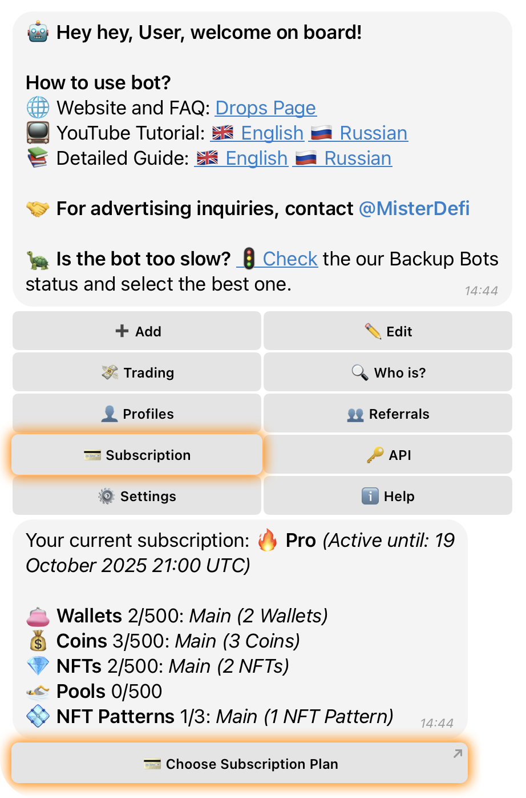
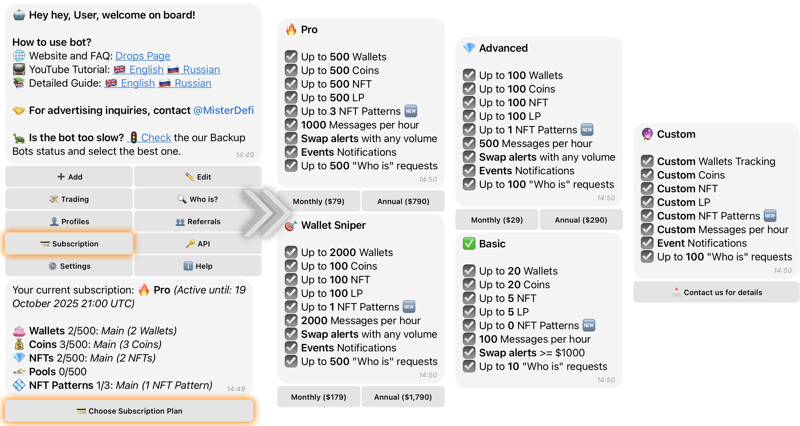

# 💳 Subscriptions

Drops Bot offers several subscription plans to expand your tracking limits and unlock advanced features. You can subscribe via the **website** or using **Telegram Stars** inside the bot.

***

### 💳 **How to Subscribe via Website**

> Suitable for any bot except **@drops** (use one of the active bots listed below)



Activate any bot from the list:

* `t.me/EtherDrops_bot`
* `t.me/EtherDrops1_bot` to `t.me/EtherDrops9_bot`
* **Premium Bots**:\
  `@EtherDrops_Premiumbot`, `@Drops_Premiumbot`, `@Drops_Premium1bot`, `@Drops_Premium2bot`, `@Drops_Premium3bot`



Tap **“💳 Subscription”** in the main menu



You'll see your current plan and tracking limits:

* 🟦 Polymarket Events
* 👛 Wallets
* 💰 Coins
* 💎 NFTs



Tap **“💳 Choose Subscription Plan”**



You’ll be redirected to the payment page in your browser



Select a **plan**, then tap **“Select Plan”**



Choose your **currency and blockchain network**

#### 🔸 Available payment options:

<table><thead><tr><th width="115.8359375">Currency</th><th width="249.16015625">Supported Networks</th></tr></thead><tbody><tr><td>USDT</td><td>ETH, BSC, Solana, Tron</td></tr><tr><td>USDC</td><td>ETH, BSC, Tron</td></tr><tr><td>BTC</td><td>BTC</td></tr><tr><td>ETH</td><td>ETH, BSC</td></tr></tbody></table>



Complete the payment



<figure><figcaption></figcaption></figure>


Your subscription will be automatically activated on your account.


***

### ⭐️ **How to Subscribe with Telegram Stars**

> Available only in the **@drops** bot.



Activate the **@drops** bot



Tap **“💳 Subscription”** in the main menu



View your current plan and limits



Tap **“💳 Choose Subscription Plan”**



Choose your desired plan and billing cycle:

* **Monthly** – billed every month
* **Annual** – billed once per year



Confirm the selected plan



The bot will display the price in **Telegram Stars** and a support contact



Tap **“Pay ⭐️”** and complete the payment via Telegram Stars



<figure><figcaption></figcaption></figure>


Your subscription is now active for the selected duration.


***

### 📦 **Subscription Plans Overview**



* 20 Wallets
* 20 Polymarket Events
* 20 Coins
* 20 NFTs
* 100 messages/hour
* Swap alerts ≥ $1000



* 100 Wallets
* 100 Polymarket Events
* 100 Coins
* 100 NFTs
* 500 messages/hour
* Swap alerts (any volume)



* 500 Wallets
* 500 Polymarket Events
* 500 Coins
* 500 NFTs
* 1000 messages/hour
* Swap alerts (any volume)



* 2000 Wallets
* 500 Polymarket Events
* 500 Coins
* 500 NFTs
* 2000 messages/hour
* Swap alerts (any volume)



The **Custom plan** is a fully personalized subscription tailored specifically to your needs.\
You can configure **any parameters** available in the bot, including:

* Number of **wallets**
* Number of **Polymarket Events**
* Number of **coins**
* Number of **NFT collections**
* Custom **message limits per hour**
* Full access to **event alerts**

> 🛠️ Everything in the Custom plan is adjustable — you decide the scale and features based on your workflow, monitoring needs, or infrastructure.\
> If you need a setup beyond standard limits, this is the plan built entirely **for you.**

📩 **Need help configuring or purchasing a Custom plan?**\
Reach out to [**@MisterDeFi**](https://t.me/MisterDeFi) or [**@edrops\_support**](https://t.me/edrops_support) — we’ll assist you personally with setup and activation.



### 🚫 **Subscription Limit Reached**

When you reach your plan limits (e.g., wallets, polymarket events, coins, nfts), the bot will notify you and suggest:

* **Editing your list** via the **“Edit”** button
* Or **upgrading your plan** via **“💳 Upgrade Subscription Plan”**

If you hit your **notification limit per hour**, the bot will also send a warning. Your hourly message cap depends on your active plan.
