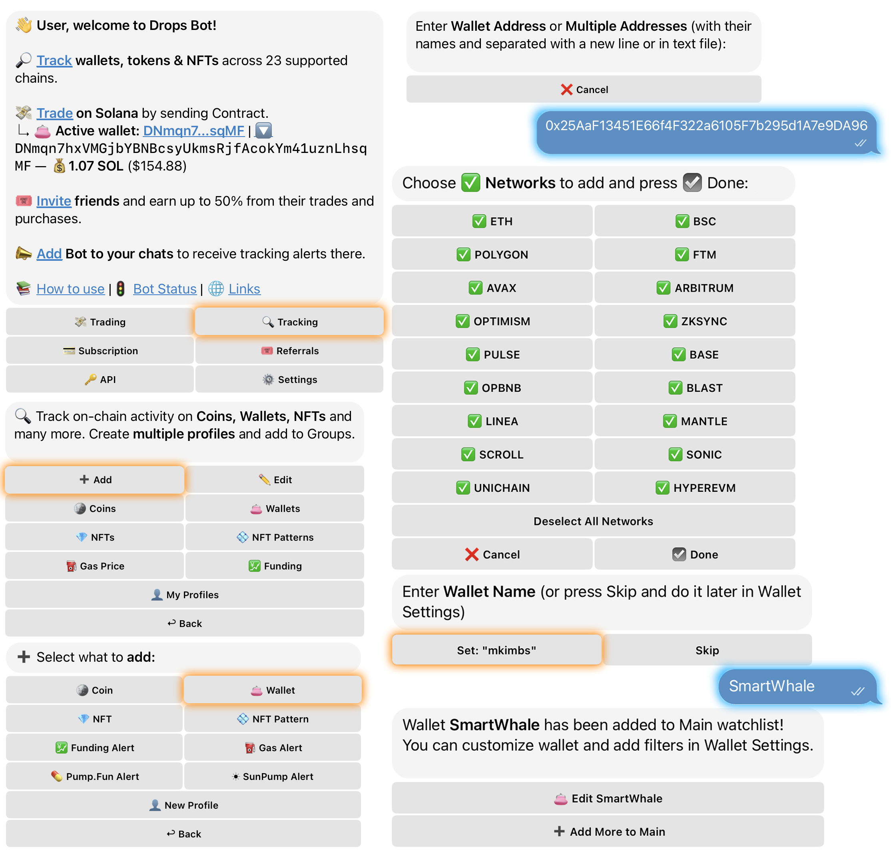
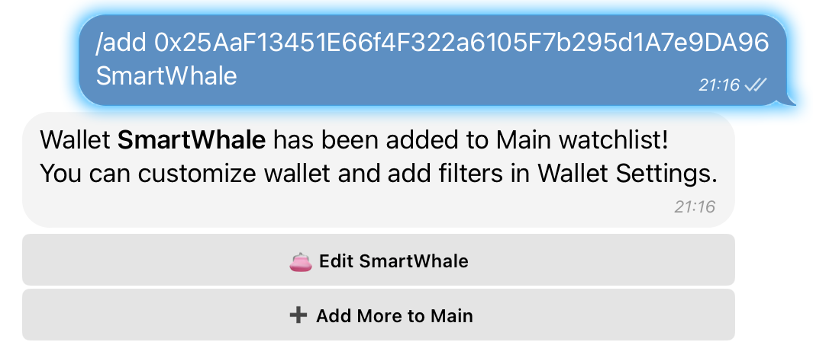
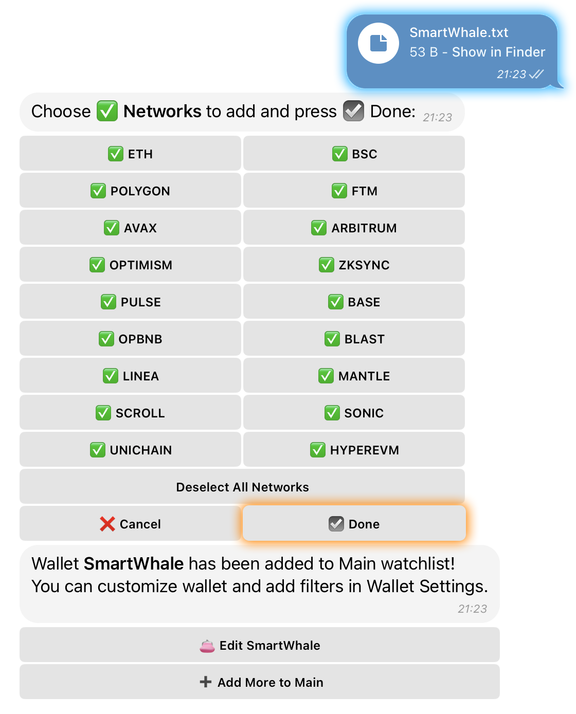

# ➕ Add Wallet

## **Ways to Add a Wallet**

You can add a wallet using the following methods:

* **Main Menu**
* **Using the command** `/add [wallet address] [wallet name]`
* **Importing a text file**


**💡 Pro Tip:** Automatic Setup Don't waste time configuring every new wallet.

Enable 🧠 **Save Previous Filters** via `Main Menu` → `Settings`. Once active, the bot automatically applies your most recent filter configurations (Networks, Tx Value, etc.) to every new wallet you add.


***

### **1️ Adding a Wallet via the Main Menu**



**Open the Main Menu** and tap on **“🔍 Tracking”**.



Select the category **“➕ Add”** and tap on **“👛 Wallets”**.



Enter the **wallet contract address**.



Choose the desired **networks** (by default, all available networks are selected).



Press **“☑️ Done”**.



Enter a **wallet name** or skip this step.

_⚠️ Wallet name limit: Up to 100 characters._



<figure><figcaption></figcaption></figure>


**Wallet successfully added to tracking.**&#x20;


***

### **2️ Adding a Wallet via the /add Command**

For quick wallet addition, use the format:

```
/add [wallet address] [wallet name]  
```


```
/add 0x25AaF13451E66f4F322a6105F7b295d1A7e9DA96 SmartWhale  
```


<div align="left"><figure><figcaption></figcaption></figure></div>


**The wallet is successfully added to the tracking list with the specified name.**&#x20;


***

### **3️ Adding a Wallet via Text File Import**

For bulk wallet addition, you can send a **text file** containing wallet addresses. Optionally, include **wallet names** in the format:

```
[wallet address] [wallet name]  
```

<div align="left"><figure><figcaption></figcaption></figure></div>


**Wallets are successfully added to tracking, applying any specified names.**&#x20;



#### **Subscription - Based Wallet Limits:**

#### ✅ **Basic** – Up to **20 wallets** 💎 **Advanced** – Up to **100 wallets** 🔥 **Pro** – Up to **500 wallets** 🎯 **Wallet Sniper** – Up to **2000 wallets**

