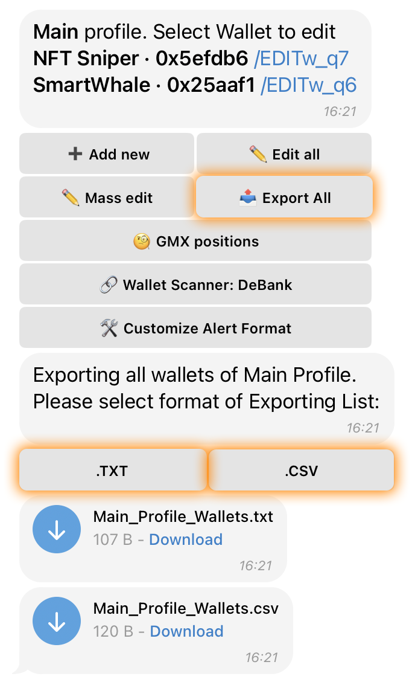

# 📤 Export Wallets

### **How to Export Your Wallets**



**Open the Main Menu** and tap on **“🔍 Tracking”**.



Select the category **“✏️ Edit”** and tap on **“👛 Wallets”**.



Tap the **“📤 Export All”** button.



Choose the required file format:

* **“.TXT”** – Exports wallets in a plain text format.
* **“.CSV”** – Exports wallets in a structured spreadsheet format.



<figure><figcaption></figcaption></figure>


Once you select the file format, the bot will generate and send a file containing all wallets stored in your **profile**.&#x20;

