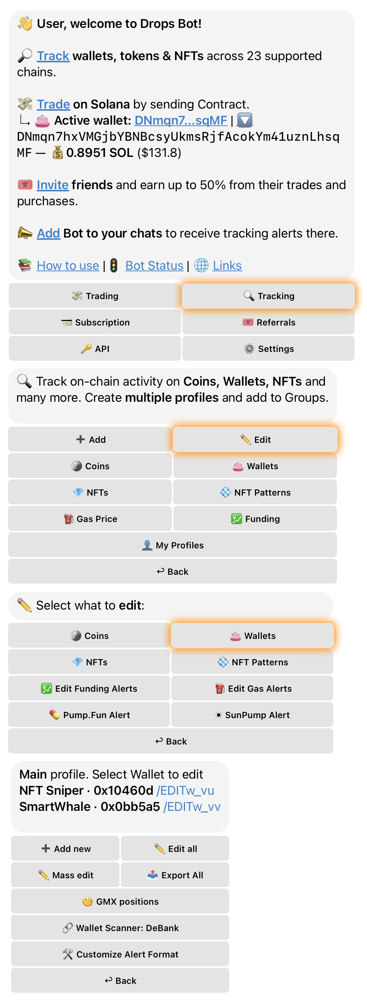

# 🔑 Accessing Wallet Settings

## 👀 Viewing All Tracked Wallets

To see a comprehensive list of all the wallets you are currently monitoring:

1. Open the **Main Menu**.
2. Select the "🔍 **Tracking**" category.
3. Tap on "**✏️ Edit**".
4. Select the "**👛 Wallets**" category.

## 📝 Editing a Specific Wallet

If you need to adjust the settings for an individual wallet:

1. Open the **Main Menu**.
2. Select the "🔍 **Tracking**" category.
3. Tap on "**✏️ Edit**".
4. Select the "**👛 Wallets**" category.
5. **Choose a wallet** from the displayed list and tap its **`/EDIT`** link.

***

<figure><figcaption>
Wallets Section
</figcaption></figure>

***

## 📦 Bulk Editing Multiple Wallets

Drops Bot provides powerful options to manage multiple wallets simultaneously:

* **Mass Edit**
  * This allows you to apply settings to a selected group of wallets. After tapping the "Mass edit" button, you can provide a list of wallet addresses by sending a message or uploading a text file.
    * _Note: This feature only applies to wallets that are already in your tracked list._

<figure><figcaption>
Mass Edit Menu
</figcaption></figure>

* **Edit All**
  * This option enables you to apply batch changes to _all_ your currently tracked wallets.\
    The **Edit all** button will appear if you are monitoring two or more wallets.

<figure><figcaption>
Edit All Menu
</figcaption></figure>


_Important: The **Mass edit** and **Edit all** features require an Advanced, Pro, Wallet Sniper, or Custom subscription plan._


## ⚡ Quick Access Tips

For faster access to your wallet settings or overview:

* **Use the `/wallets` command:** Type `/wallets` in the chat to quickly open a list of all your tracked wallets.
* **Send a Wallet Address:** Simply send a tracked wallet's address directly in the chat with the bot. Drops Bot will automatically open the editing menu for that specific wallet.

***
