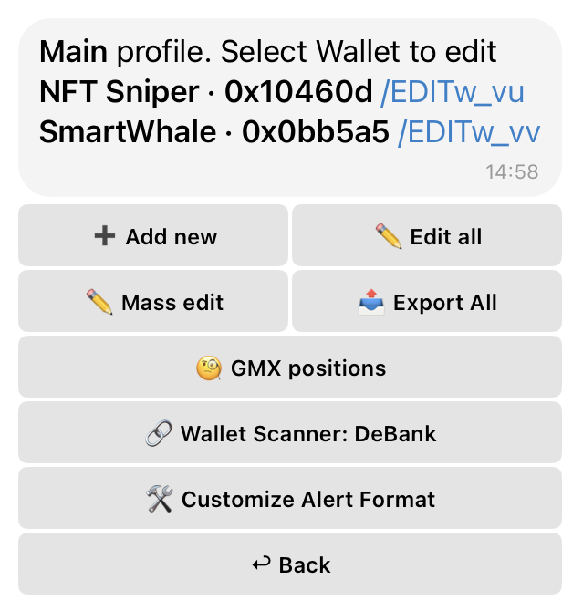

# 🔔 Configuring Wallet Alerts and Parameters

## 🌐 Global Wallet Management Options

<figure><figcaption></figcaption></figure>

These options are accessible from the main "Wallets" menu and affect your wallet tracking and data output at a broader level:

* **📤 Export All** – Generates a file containing all your currently tracked wallet addresses.
* **🧐 GMX Positions** – Displays open positions on GMX for your tracked wallets, helping traders monitor leveraged trades directly within the bot.
* **🔗 Wallet Scanner** – Choose a data provider for your wallet activity notifications. When an alert is triggered, the notification can include links or supplementary data from the selected source.
  * **Available Providers:**
    * **DeBank:** Monitors decentralized finance (DeFi) activity linked to the wallet.
    * **Blockscan:** Tracks addresses and transactions associated with the wallet, providing Etherscan-like data.
    * **OKX (Web3 Portfolio):** Offers insights into wallet assets and on-chain portfolio performance, often including NFTs and DApps.

🛠️ Customize Alert Format

Fine-tune how your wallet notifications appear by selecting which information fields to include and how data is displayed.

* **Included Fields:**
  * **Sent:** Display outgoing transactions from the wallet.
  * **Received:** Show incoming transactions to the wallet.
  * **To:** Include the recipient addresses in notifications.
  * **From:** Include the sender addresses in notifications.
  * **Price:** Include the current token price in notifications.
  * **M. Cap:** Show the token's market capitalization.
  * **Price Change:** Displays the percentage change in the token’s price over a selected period.
  * **FDV:** Show the Fully Diluted Valuation (FDV) of the token.
  * **24h Volume:** Display the 24-hour trading volume of the token.
  * **Liquidity (Sol):** Displays current liquidity data specifically for Solana-based assets.
  * **Contract:** Display token contract details.
  * **Holders:** Show the number of token holders for the asset.
  * **Audit:** Displays security audit details and risk analysis for the token.
  * **Tx Hash:** Display the transaction hash for easy lookup.
  * **Price Chart:** Attach a graphical price chart for tracked tokens within the notification.
  * **Edit Wallet:** Adds a button to quickly open the wallet's editing menu directly from the notification.
  * **Delete Wallet:** Adds a button to quickly delete a tracked wallet directly from the notification, eliminating the need to manually search for it in your profiles or lists.
  * **Buy Button:** Adds a quick buy button (available only for Solana transactions).
  * **Hashtag Mode:** Replaces the display of coin names (e.g., _LLJEFFY_) and tracked wallet labels (e.g., _So 75%_) with clickable hashtags (e.g., `#LLJEFFY`, `#So75`).\
    This makes it easier to filter and navigate messages using Telegram’s built-in search — for example, searching `#LLJEFFY` will show all transactions related to that token.
* **Additional Settings:**
  * **Chart Source:** Select the preferred charting platform for transaction and market data in your notifications:
    * **GeckoTerminal:** Provides visual charts for trading volume, price, and token activity.
    * **DEX Screener:** Displays data from multiple decentralized exchanges (DEX), including price charts, liquidity, and trading volumes.
    * **GMGN:** A comprehensive analytics tool for market movements and token activity.
  * **Swap Format:** Determines how swap transaction data appears in notifications:
    * **Simple:** Displays basic swap details (price and volume).
    * **Advanced:** Includes additional details like fees, slippage, and liquidity data.
  * **Emoji:** Enables or disables emoji in notifications and interface:
    * **On:** Enhances readability and visual cues with emoji-based indicators.
    * **Off:** Provides a cleaner, text-only interface for a more minimalist look.

## 📝 Wallet-Specific Settings (/EDIT Mode)

<figure><figcaption></figcaption></figure>

When you enter `/EDIT` mode for an individual wallet, you can customize the following detailed settings to refine its monitoring:

*   ⚙️ Filters

    Adjust tracking filters to receive notifications only for specific transaction types or values, helping to reduce noise.

    * 🪙 **Coin Filters:** Filter notifications based on specific characteristics of the tokens involved in transactions (excluding gas tokens). These filters are available exclusively for **EVM networks, Solana (SOL), and Tron (TRX)**. You can set a minimum or maximum value, or a specific range, using `<` (less than), `>` (greater than), or the `Min - Max` format (e.g., `<100k`, `>50000`, or `100000 - 200000`).
      * **💎 M.Cap:** Filter by the token's Market Capitalization.
      * **📊 24h Volume:** Filter by the token's 24-hour trading volume.
      * **👤 Holders:** Filter by the number of unique token holders.
        * _Note:_ The Holders filter is **not available** for Solana (SOL) and Tron (TRX) networks.
    * **💸 Tx Value:** Receive notifications only for transactions exceeding a specified amount.
    * **🚦 Tx Types:** Customize transaction tracking based on direction:
      * **IN:** Track incoming transactions to the wallet.
      * **OUT:** Track outgoing transactions from the wallet.
      * **ALL:** Track both incoming and outgoing transactions.
    *   🧩 **Tx Status:** Control which transaction statuses appear in alerts:

        * **Success** — only confirmed (successful) transactions will trigger alerts.
        * **Success and Failed** — alerts will include both successful and failed transactions.

        > Use this to decide whether you want to monitor **failed swaps, transfers, or contract interactions** as part of your on-chain analysis.
    * **🔈 Allowed Addresses:** Track only transactions involving specific whitelisted addresses.
    * **🔇 Hidden Addresses:** Ignore transactions related to specific blacklisted addresses, useful for excluding known bot activity or irrelevant addresses.
*   📡 Networks

    Manage the specific blockchain networks connected to this wallet for monitoring. This allows you to enable or disable tracking on certain chains for the selected wallet.
*   ⭐ Favorite

    Add or remove the wallet from your favorites list for quicker access and prioritization in your dashboard.
*   ✏️ Rename

    Change the custom name of the wallet for easier identification in your tracked list.
*   🗑️ Delete

    Remove this specific wallet from your tracking watchlist.
*   📅 Events

    Configure your notification preferences for various types of on-chain events related to this wallet:

    * **Transfers:** Alerts for token transfers between wallets.
    * **Swap: Buy:** Alerts for token purchases via Decentralized Exchanges (DEX).
    * **Swap: Sell:** Alerts for token sales via Decentralized Exchanges (DEX).
    * **NFT Transfers:** Alerts for NFT transfers between wallets.
    * **NFT Mint:** Alerts for newly minted NFTs originating from or related to the wallet.
    * **Approve:** Alerts for token approvals granted to third-party contracts by this wallet, which can be a security concern.
    * **Contract Creation:** Alerts for newly created smart contracts linked to or deployed by this tracked wallet.
